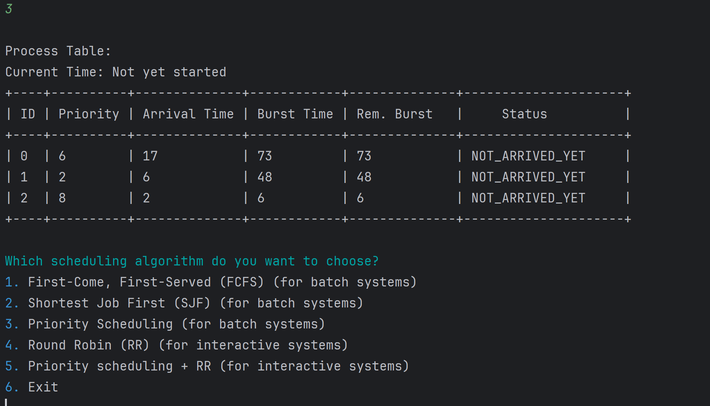

# CPU Scheduler Simulator

## Description
The CPU Scheduler Simulator is designed to simulate different CPU scheduling algorithms, providing insights into how various algorithms prioritize and manage processes. This tool is valuable for students and educators in computer science, particularly in operating systems courses.

## Components
- **Main.java**: Entry point that orchestrates the simulation, utilizing various schedulers.
- **Process.java**: Represents a process with attributes necessary for scheduling.
- **Scheduler.java**: Abstract class defining essential scheduler operations.
- **Displayer.java**: Handles the output of scheduling results.
- **RandomProcessesGenerator.java**: Generates a set of random processes to be used in simulations.
- **FCFS.java**: Implements the First-Come, First-Served scheduling algorithm.
- **SJF.java**: Implements the Shortest Job First scheduling algorithm.
- **RoundRobin.java**: Implements the Round Robin scheduling algorithm.
- **PriorityScheduler.java**: Schedules processes based on a priority system.
- **PriorityRoundRobin.java**: Combines the Priority and Round Robin scheduling methods for a hybrid approach.

## Main
**File:** `Main.java`

# Process Scheduling Simulator

## Overview

The Process Scheduling Simulator is a Java application that simulates various process scheduling algorithms. This README provides an overview of the simulator and explains the functionality implemented in the provided code.

## Features

- Simulates several process scheduling algorithms, including FCFS, SJF, Priority Scheduling, and Round Robin.
- Allows users to input processes manually, read processes from a file, or generate processes randomly.
- Provides an option to display all steps during the simulation.
- Supports interactive scheduling algorithms for interactive systems.

## Usage

To use the Process Scheduling Simulator, follow these steps:

1. Clone or download the repository to your local machine.
2. Compile the Java files using your preferred IDE or command-line compiler.
3. Run the Main class (`Main.java`).
4. Choose how to input processes:
   - Enter processes manually.
   - Read processes from a file.
   - Generate processes randomly.
5. Choose a scheduling algorithm to simulate.
6. View the simulation results and performance metrics.
## Follow the steps to choose how to input processes:

## Enter processes manually:

##  Read processes from a file:

## Generate processes randomly:

## Supported Algorithms

The simulator supports the following scheduling algorithms:

1. First-Come, First-Served (FCFS): Executes processes in the order they arrive.
2. Shortest Job First (SJF): Executes the process with the shortest burst time first.
3. Priority Scheduling: Executes processes based on their priority.
4. Round Robin (RR): Executes processes in a circular manner with a fixed time quantum.
5. Priority Scheduling + Round Robin: Executes processes based on priority, with a Round Robin approach for processes with the same priority.

## Implementation Details

- The `Main` class serves as the entry point for the application. It provides a user interface for choosing scheduling algorithms and input methods.
- Process scheduling algorithms are implemented in separate classes (`FCFS`, `SJF`, `PriorityScheduler`, `RoundRobin`, `PriorityRoundRobin`) by extending the `Scheduler` class.
- Process objects represent individual processes with attributes such as ID, arrival time, burst time, and priority.

## Dependencies

The simulator uses the following Java libraries:

- `java.swing.*`: For GUI components and file selection.
- `java.io.File`, `java.util.Scanner`: For file input and command-line interaction.
- `java.nio.file.Files`, `java.nio.file.Paths`: For file reading and writing.
- `java.util.ArrayList`, `java.util.List`: For storing process data.

## Conclusion

The Process Scheduling Simulator provides a flexible and interactive environment for exploring various process scheduling algorithms. By simulating different scenarios and analyzing performance metrics, users can gain insights into the behavior of scheduling algorithms in different contexts.

## Algorithm Descriptions

  ## First Come First Serve (FCFS)
**File:** `FCFS.java`

**Description:**  

The First-Come-First-Served (FCFS) scheduling algorithm is a simple scheduling strategy used by operating systems to manage processes. In this algorithm, processes are executed in the order they arrive, without any preemption. This README provides an overview of the FCFS algorithm and explains the functionality implemented in the provided code.

## Algorithm Description

### Arrival Time Sorting

Processes are sorted based on their arrival times in ascending order. This ensures that the processes are executed in the order they arrive.

### Simulation Loop

- Iterate through the sorted list of processes.
- If the current time is less than the arrival time of a process, update the current time to the arrival time of that process and mark it as ready.
- Set the status of the current process to running and calculate its waiting time.
- Update the arrival times of other processes that arrive while the current process is running.
- Update the current time and process status when the current process terminates.

### CPU Idle Time Handling

If there's idle time before the arrival of the next process, add it to the total time.

### Display Performance Metrics

Display the performance metrics such as turnaround time, waiting time, and CPU usage.

## Code Explanation

- The `simulate` method takes an ArrayList of Process objects as input.
- Processes are sorted based on their arrival times using the Comparator class.
- The simulation loop iterates through each process:
  - If the current time is before the arrival time of the process, the current time is updated, and the process is marked as ready.
  - The process is set to running, and its waiting time is calculated.
  - Arrival times of other processes are updated if they arrive while the current process is running.
  - When a process terminates, its status is updated, and relevant metrics are calculated.
- After the simulation loop, any remaining idle time is handled.
- Performance metrics such as CPU usage are calculated and displayed.

## Conclusion

The FCFS scheduling algorithm implemented in the provided code ensures that processes are executed in the order they arrive. The code effectively simulates the scheduling process, updating process states, and displaying relevant information at each step.

## Performance Metrics for FCFS:

## Shortest Job First (SJF)
**File:** `SJF.java`

**Description:**  

The Shortest Job First (SJF) scheduling algorithm selects the process with the smallest burst time for execution, ensuring that shorter jobs are completed first. This README provides an overview of the SJF algorithm and explains the functionality implemented in the provided code.

## Algorithm Description

### Initialization

- Initialize lists to track remaining, ready, and terminated processes.

### Simulation Loop

- Run the simulation loop until all processes have terminated:
  - Add newly arrived processes to the ready queue.
  - If no process has arrived yet, move the current time to the minimum arrival time of the remaining processes.
  - Choose the process to run from the ready queue based on the shortest job (smallest burst time).
  - Remove the chosen process from the ready queue and run it.
  - Check if any process arrives while the current one is running.
  - Update process status, remaining burst time, and current time accordingly.
  - If a process terminates, update its status, termination time, and move it to the terminated list.
  - Display the simulation table at each step.

### Performance Metrics

- Finally, display performance metrics such as turnaround time, waiting time, and CPU usage.

## Code Explanation

- The `simulate` method takes an ArrayList of Process objects as input.
- Processes are added to the ready queue based on their arrival times and sorted by burst time.
- The simulation loop iterates through each process:
  - Processes are chosen for execution based on the shortest burst time, with ties broken by arrival time (First Come, First Served).
  - Process execution continues until termination, with arrival times of other processes checked during execution.
- Performance metrics are calculated and displayed at the end of the simulation.

## Conclusion

The Shortest Job First (SJF) scheduling algorithm implemented in the provided code effectively manages processes by prioritizing shorter jobs for execution. The code simulates the scheduling process, updating process states, and displaying relevant information at each step.

## Performance Metrics for SJF:

## Round Robin (RR)
**File:** `RoundRobin.java`

**Description:**  

The Round Robin scheduling algorithm is a preemptive scheduling algorithm where each process is assigned a fixed time unit, called a time quantum, to execute. If a process does not complete within the time quantum, it is preempted and placed back in the ready queue to wait for its turn again. This README provides an overview of the Round Robin algorithm and explains the functionality implemented in the provided code.

## Algorithm Description

### Initialization

- Initialize the time quantum for the Round Robin algorithm.

### Simulation Loop

- Run the simulation loop until all processes have terminated:
  - Add newly arrived processes to the ready queue.
  - If no process has arrived yet, move the current time to the minimum arrival time of the remaining processes.
  - Choose the process to run from the front of the ready queue.
  - Run the chosen process for a quantum of time.
  - Check if any process arrives while the current one is running.
  - Update process status, remaining burst time, and current time accordingly.
  - If a process terminates, update its status, termination time, waiting time, and move it to the terminated list.
  - Display the simulation table at each step.

### Performance Metrics

- Finally, display performance metrics such as turnaround time, waiting time, and CPU usage.

## Code Explanation

- The `simulate` method takes an ArrayList of Process objects as input.
- Processes are added to the ready queue based on their arrival times.
- The simulation loop iterates through each process:
  - Processes are chosen for execution from the front of the ready queue.
  - Process execution continues until termination, with arrival times of other processes checked during execution.
- Performance metrics are calculated and displayed at the end of the simulation.

## Conclusion

The Round Robin scheduling algorithm implemented in the provided code effectively manages processes by providing them with equal opportunities to execute within a fixed time quantum. The code simulates the scheduling process, updating process states, and displaying relevant information at each step.

## Performance Metrics for Round Robin:

## Priority Scheduling
**File:** `PriorityScheduler.java`

**Description:**  

The priority scheduling algorithm assigns priorities to each process and executes the process with the highest priority first. This provides an overview of the Priority Scheduling algorithm and explains the functionality implemented in the provided code.

## Algorithm Description

### Initialization

- Initialize lists to track remaining, ready, and terminated processes.

### Simulation Loop

- Run the simulation loop until all processes have terminated:
  - Add newly arrived processes to the ready array.
  - If no process has arrived yet, move the current time to the minimum arrival time of the remaining processes.
  - Choose the process to run based on priority (lower priority numbers indicate higher priority).
  - Remove the chosen process from the ready queue and run it.
  - Check if any process arrives while the current one is running.
  - Update process status, remaining burst time, and current time accordingly.
  - If a process terminates, update its status, termination time, and move it to the terminated list.
  - Display the simulation table at each step.

### Performance Metrics

- Finally, display performance metrics such as turnaround time, waiting time, and CPU usage.

## Code Explanation

- The `simulate` method takes an ArrayList of Process objects as input.
- Processes are added to the ready array based on their arrival times and sorted by priority.
- The simulation loop iterates through each process:
  - Processes are chosen for execution based on priority, with ties broken by arrival time (First Come, First Served).
  - Process execution continues until termination, with arrival times of other processes checked during execution.
- Performance metrics are calculated and displayed at the end of the simulation.

## Conclusion

The Priority Scheduling algorithm implemented in the provided code effectively manages processes based on their priorities, ensuring that higher priority processes are executed first. The code simulates the scheduling process, updating process states, and displaying relevant information at each step.

## Performance Metrics for Priority:

## Combining Algorithms: Priority Round Robin
**File:** `PriorityRoundRobin.java`

**Description:**  

The Priority Round Robin scheduling algorithm is a variation of the Round Robin algorithm that introduces priority levels for processes. Processes with higher priorities are given precedence over processes with lower priorities. This README provides an overview of the Priority Round Robin algorithm and explains the functionality implemented in the provided code.

## Algorithm Description

### Initialization

- Initialize the quantum (time slice) for each priority level.
- Create priority queues to hold processes for each priority level.

### Simulation Loop

- Initialize lists to track remaining and terminated processes.
- Run the simulation loop until all processes have terminated:
  - Add newly arrived processes to their respective priority queues.
  - If no process has arrived yet, move the current time to the minimum arrival time of the remaining processes.
  - Find the highest priority non-empty queue.
  - Choose the process to run from the highest priority queue.
  - Run the chosen process for a quantum of time.
  - Check if any process arrives while the current one is running.
  - Update process status, remaining burst time, and current time accordingly.
  - If a process terminates, update its status, termination time, waiting time, and move it to the terminated list.
  - If a process does not terminate, add it back to the rear of its priority queue.
  - Display the simulation table at each step.

### Performance Metrics

- Finally, display performance metrics such as turnaround time, waiting time, and CPU usage.

## Code Explanation

- The `simulate` method takes an ArrayList of Process objects as input.
- Priority queues are used to manage processes based on their priority levels.
- The simulation loop iterates through each process:
  - Processes are added to their respective priority queues based on their arrival times.
  - The process to run is chosen from the highest priority non-empty queue.
  - Processes are run for a quantum of time, and arrival times of other processes are checked during execution.
  - Performance metrics are calculated and displayed at the end of the simulation.

## Conclusion

The Priority Round Robin scheduling algorithm implemented in the provided code effectively manages processes with different priority levels, ensuring that higher priority processes are executed with precedence. The code simulates the scheduling process, updating process states, and displaying relevant information at each step.

## Performance Metrics for Priority + Round Robin:

  
## Usage Example
Run the application and follow the prompts to select an algorithm and provide process details. The simulator will execute and provide a detailed display of the scheduling order and metrics.

## Compilation and Execution Instructions
To compile and run the simulation:
1. Ensure you have Java installed on your system.
2. Navigate to the directory containing the source files.
3. Compile the Java files using the following command:
   - **method1**:
   Navigate to the src directory and run the following commands:
   javac main.java
   java Main
   - **method2**:
   Navigate to the directory where the Scheduling-algorithms-simulation.jar file is located, then run the following       
  command:
  **java -jar Scheduling-algorithms-simulation.jar**
5. Run the simulation by executing the `Main` class.
6. Follow the on-screen options to choose different scheduling algorithms or test scenarios. If you want to test the algorithms with specific process sets, you can use the provided `file.txt` examples or create new ones and upload them to test their behavior.

